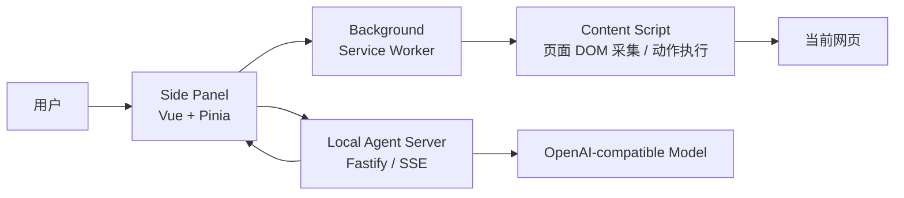

# 项目主流程导览

这份文档帮助后续开发快速看懂 Chrome AI Agent 的主链路：用户在 Chrome Side Panel 里提出任务，插件读取当前网页上下文，把任务交给本地 Agent 服务调用模型；模型可以返回回答，也可以请求受控页面动作；动作执行前由用户确认，再通过扩展消息回到当前网页执行。

## 1. 一句话架构

项目由四个运行面组成：

- Side Panel：Vue 3 用户界面，负责聊天、页面上下文展示、动作确认和 Agent run 编排。
- Background Service Worker：扩展中枢，负责打开侧边栏、监听标签页变化、转发消息、执行浏览器级动作。
- Content Script：注入网页，负责采集页面上下文、选中文本菜单和白名单 DOM 动作执行。
- Local Agent Server：本地 Fastify 服务，负责接入 OpenAI 兼容接口、生成 SSE 事件、维护 run 状态和工具调用转换。



## 2. 代码入口地图

| 模块                | 关键文件                                | 主要职责                                                                  |
| ------------------- | --------------------------------------- | ------------------------------------------------------------------------- |
| 扩展 Manifest       | `manifest.config.ts`                    | 声明 MV3 权限、Background、Side Panel、Content Script 和本地代理访问权限  |
| Vite/CRXJS          | `vite.config.ts`                        | 通过 `@crxjs/vite-plugin` 构建扩展，开发期固定 `localhost:5173`           |
| Side Panel 入口     | `src/side-panel/App.vue`                | 初始化页面上下文，监听选区任务和标签页变化，串起聊天面板                  |
| Agent run store     | `src/side-panel/stores/agent-run.ts`    | 创建 run、消费 SSE、维护消息流、执行/跳过待确认动作                       |
| 页面上下文 store    | `src/side-panel/stores/page-context.ts` | 向 Background 请求当前页上下文，保存 Side Panel 当前页面状态              |
| 扩展消息协议        | `src/shared/extension-messages.ts`      | 定义 `page_context:get`、`agent_action:execute`、选区操作和标签页变化消息 |
| 共享领域类型        | `src/shared/types.ts`                   | 定义 `PageContext`、`AgentRun`、`AgentAction`、SSE event 等核心类型       |
| Background          | `src/background/service-worker.ts`      | 接收 Side Panel / Content Script 消息，转发页面采集和动作执行             |
| 浏览器级动作        | `src/background/action-executors.ts`    | 执行 `open_url`，并把页面动作转发给 Content Script                        |
| Content Script 入口 | `src/content/index.ts`                  | 注册选中文本菜单，响应页面上下文采集和动作执行消息                        |
| 页面采集            | `src/content/collect-page-context.ts`   | 提取标题、URL、选区、可见文本、标题结构、表格和可交互元素                 |
| DOM 动作执行        | `src/content/execute-action.ts`         | 执行高亮、点击、填写、滚动、复制等白名单动作，并阻断高风险操作            |
| 本地服务入口        | `server/index.ts`                       | 初始化 Fastify、CORS 和 Agent 路由                                        |
| Agent 路由          | `server/agent-routes.ts`                | 提供 run 创建、SSE 流、停止 run、健康检查接口                             |
| 模型工具            | `server/model-tools.ts`                 | 定义可给模型调用的工具，并把 tool call 转成 `AgentAction`                 |
| Prompt/计划         | `server/agent-prompt.ts`                | 组装模型 prompt，生成前端展示用计划                                       |
| run 存储            | `server/run-store.ts`                   | 内存保存 run、会话上下文和活跃流                                          |

## 3. 启动后的运行形态

开发时通常运行：

```bash
pnpm dev:all
```

它会同时启动：

- `pnpm dev`：CRXJS/Vite 扩展开发服务器，维护开发态 `dist`，供 Chrome 加载。
- `pnpm server:dev`：本地 Agent 服务，默认监听 `http://127.0.0.1:8787`。

Chrome 中实际加载的是项目根目录下的 `dist` 目录。开发期不需要每次手动 `pnpm build`；保持 `pnpm dev` 运行，Side Panel UI 通常走 HMR，Content Script 改动必要时刷新目标网页，Background 或 Manifest 改动可能需要刷新扩展。

## 4. 主流程：用户输入任务

### 4.1 Side Panel 读取当前网页

1. 用户打开插件侧边栏，`src/side-panel/App.vue` 在 `onMounted` 时调用 `pageContext.refresh()`。
2. `src/side-panel/stores/page-context.ts` 发送扩展消息：

```ts
{
  type: "page_context:get",
  payload: {
    includeSelection: true,
    includeInteractiveElements: true
  }
}
```

3. `src/background/service-worker.ts` 收到消息后定位当前活动标签页，并通过 `chrome.tabs.sendMessage` 转发给 Content Script。
4. `src/content/index.ts` 调用 `collectPageContext()`，返回 `PageContext`。
5. Side Panel 保存上下文，用于页面信息栏展示，也会作为后续 Agent 请求的输入。

页面上下文包含：

- `url`、`origin`、`title`
- 当前选中文本 `selectedText`
- 可见文本摘要 `visibleTextSummary`
- 标题结构 `headings`
- 表格预览 `tables`
- 可交互元素清单 `interactiveElements`

可交互元素会在 `src/content/element-registry.ts` 中注册成稳定的临时 element id，后续模型请求点击或填写时只能引用这些 id。

### 4.2 创建 Agent run

1. 用户在输入框提交任务。
2. `src/side-panel/App.vue` 的 `start()` 会再次刷新页面上下文，避免拿到过期页面。
3. `src/side-panel/stores/agent-run.ts` 调用 `createAgentRun(goal, pageContext, conversation)`。
4. `src/shared/api-client.ts` 请求本地服务：

```text
POST /api/agent/runs
```

5. `server/agent-routes.ts` 校验 `goal` 和 `pageContext`，用 `buildPrompt()` 生成模型 user message，并把 run 存入 `server/run-store.ts` 的内存 Map。
6. 服务返回 `AgentRun`，初始状态是 `created`。

### 4.3 订阅 SSE 流式结果

创建 run 后，Side Panel 马上调用 `streamAgentRun()`：

```text
POST /api/agent/runs/:runId/stream
Accept: text/event-stream
```

本地服务会按顺序写出 SSE 事件：

1. `status: planning`：进入规划阶段。
2. `conversation_message`：把本轮 user prompt 同步回前端会话历史。
3. `message_delta(channel: thinking)`：展示简短思考状态。
4. `plan`：展示计划步骤，例如读取页面、结合选区、可能请求动作。
5. `status: running`：开始调用模型。
6. `message_delta(channel: answer)`：模型回答的增量文本。
7. `action_request`：如果模型发起工具调用，服务把 tool call 转成待执行动作。
8. `status: requires_confirmation` / `completed` / `blocked` / `failed`：根据结果进入对应状态。

前端的 `agent-run.ts` 逐条消费事件，并把事件交给 `src/side-panel/stores/agent-run-messages.ts` 变成聊天消息、计划块、动作确认卡片或错误消息。

## 5. 模型工具到页面动作的流程

模型不能直接运行脚本，也不能直接修改页面。它只能调用 `server/model-tools.ts` 中暴露的工具。目前模型可请求：

- `open_url`：打开 http/https 页面。
- `click_element`：点击当前页面上下文里已有 id 的元素。
- `fill_input`：填写当前页面上下文里已有 id 的输入控件。

工具调用会先经过本地服务校验：

1. `accumulateToolCalls()` 收集流式 tool call。
2. `createActionFromToolCall()` 解析 JSON 参数。
3. 参数必须匹配工具 schema；元素动作必须提供 `element_id`。
4. URL 必须通过 `normalizeHttpUrl()`，只允许 http/https。
5. 合法 tool call 会转成 `AgentAction` 并通过 `action_request` 发给 Side Panel。

`AgentAction` 是插件真正认识的动作协议：

```ts
{
  id: string;
  toolName: AgentToolName;
  toolCallId?: string;
  riskLevel: "low" | "medium" | "high";
  requiresConfirmation: boolean;
  target?: {
    elementId?: string;
    description: string;
  };
  input?: {
    text?: string;
    value?: string;
    url?: string;
  };
  reason: string;
}
```

## 6. 动作确认与执行

当 Side Panel 收到 `action_request`：

1. `agent-run-messages.ts` 会生成动作确认消息。
2. `agent-run.ts` 把动作放到 `pendingAction`。
3. 用户点击「执行」后，`executePendingAction()` 调用 `executeAction(action)`。
4. Side Panel 发送扩展消息：

```ts
{
  type: "agent_action:execute",
  payload: {
    runId,
    action
  }
}
```

5. `src/background/service-worker.ts` 调用 `executeAgentAction()`。
6. 如果是 `open_url`，在 Background 中直接用 `chrome.tabs.create()` 打开新标签页。
7. 如果是页面 DOM 动作，Background 继续转发给 Content Script。
8. `src/content/execute-action.ts` 执行点击、填写、高亮、滚动等白名单动作。
9. 执行结果以 `AgentActionResult` 返回 Side Panel。

执行前后有几层保护：

- `action.riskLevel === "high"` 会被 Background 和 Content Script 双重阻断。
- Content Script 会重新检查目标元素是否存在、可见、未禁用。
- 密码、token、支付、验证码等敏感字段会被识别并阻断。
- 未注册或已失效的 element id 不会被执行。
- 未知工具动作默认阻断。

## 7. 工具结果回传与连续运行

如果动作来自模型 tool call，会带有 `toolCallId`。动作完成后：

1. `agent-run.ts` 把 `AgentActionResult` 追加成 OpenAI tool message。
2. 如果动作可能导致页面变化或新标签页打开，前端会重新读取页面上下文。
3. `continueAfterToolResult()` 再次调用：

```text
POST /api/agent/runs/:runId/stream
```

4. 这次请求会带上最新 `conversation`，其中包含 assistant tool call 和 tool result。
5. 本地服务继续调用模型，让模型基于动作结果生成下一段回答或下一个动作。

这就是“回答 -> 请求动作 -> 用户确认 -> 执行动作 -> 回传结果 -> 继续回答”的闭环。

## 8. 选中文本快捷菜单流程

Content Script 启动时会执行 `setupSelectionMenu()`：

1. 用户在网页中选中文本。
2. `src/content/selection-menu.ts` 在选区附近显示 `翻译`、`解释`、`添加到对话`。
3. 点击菜单后，Content Script 发送：

```ts
{
  type: "selection_action:invoke",
  payload: {
    action,
    selectedText,
    pageTitle,
    pageUrl,
    requestedAt
  }
}
```

4. Background 把 payload 存到 `chrome.storage.local` 的 `pendingSelectionAction`，并打开 Side Panel。
5. `src/side-panel/App.vue` 监听 storage 变化或启动时主动读取 pending action。
6. Side Panel 根据动作生成 prompt：

- `translate`：自动发起翻译任务。
- `explain`：自动发起解释任务。
- `add_to_chat`：只把选中文本填入输入框，等待用户继续编辑。

## 9. 标签页变化与页面上下文刷新

Background 监听：

- `chrome.tabs.onActivated`
- `chrome.tabs.onUpdated`

当活动标签页切换、标题变化、URL 变化或加载完成时，Background 发送：

```ts
{
  type: "active_tab:changed",
  payload: {
    tabId,
    windowId,
    url,
    title,
    status
  }
}
```

Side Panel 收到后调用 `pageContext.refresh({ tabId })`，保持页面信息栏和下一次 Agent run 的上下文尽量同步。

## 10. 状态模型

`AgentRunStatus` 描述一次 run 的整体状态：

| 状态                    | 含义                         |
| ----------------------- | ---------------------------- |
| `idle`                  | 前端空闲状态                 |
| `created`               | 本地服务已创建 run           |
| `planning`              | 服务正在准备上下文和计划事件 |
| `running`               | 正在调用模型或继续执行流程   |
| `requires_confirmation` | 模型请求了需要用户确认的动作 |
| `stopped`               | 用户终止了当前 run           |
| `completed`             | 本轮回答自然结束             |
| `blocked`               | 模型工具调用或动作被策略阻断 |
| `failed`                | 服务、网络或模型调用失败     |

`AgentActionStatus` 描述单个动作：

| 状态                   | 含义                           |
| ---------------------- | ------------------------------ |
| `pending_confirmation` | 等待用户确认                   |
| `confirmed`            | 用户已确认，前端消息进入确认态 |
| `skipped`              | 用户跳过动作                   |
| `running`              | 动作执行中                     |
| `succeeded`            | 动作执行成功                   |
| `blocked`              | 动作被安全策略阻断             |
| `failed`               | 动作执行失败                   |

## 11. 开发时最常改的地方

新增或调整 UI：

- 改 `src/side-panel/components/*`
- 状态编排改 `src/side-panel/stores/agent-run.ts`
- 消息渲染或事件应用改 `src/side-panel/stores/agent-run-messages.ts`

新增页面采集字段：

- 改 `src/shared/types.ts` 的 `PageContext`
- 改 `src/content/collect-page-context.ts`
- 如需给模型使用，同步改 `server/agent-prompt.ts`

新增扩展内部消息：

- 先改 `src/shared/extension-messages.ts`
- 再分别补齐 Side Panel、Background、Content Script 的收发逻辑

新增模型可调用工具：

- 改 `src/shared/types.ts` 的 `AgentToolName`
- 在 `server/model-tools.ts` 增加工具 schema、参数解析和 `AgentAction` 转换
- 在 `src/content/execute-action.ts` 或 `src/background/action-executors.ts` 增加实际执行器
- 根据风险等级决定是否 `requiresConfirmation`
- 补充测试，尤其是参数校验、URL 校验或高风险阻断

调整本地服务接口：

- 改 `server/agent-routes.ts`
- 前端请求封装在 `src/shared/api-client.ts`
- run 状态裁剪和存储在 `server/run-store.ts`

## 12. 开发验证清单

常规改动后建议运行：

```bash
pnpm typecheck
pnpm server:typecheck
pnpm test
```

涉及扩展构建、Manifest、CRXJS 或协议调整时再运行：

```bash
pnpm build
git diff --check
```

人工验证建议覆盖：

1. `pnpm dev:all` 正常启动。
2. Chrome 加载 `dist` 后 Side Panel 能打开。
3. 普通网页能读取标题、URL、选区和可交互元素数量。
4. 输入普通问题能看到流式回答。
5. 需要动作的任务会先出现确认卡片。
6. 点击或填写动作确认后能返回执行结果，并继续对话。
7. 选中文本菜单的翻译、解释、添加到对话都能按预期触发。

## 13. 关键边界

- Chrome 扩展不保存模型 API Key，Key 只在本地 Node 代理的 `.env` 中。
- 本地服务当前用内存保存 run，服务重启后历史 run 会丢失。
- Content Script 不能运行在 `chrome://`、扩展页等受限页面；这类页面会返回 fallback context。
- 模型输出不会直接变成脚本执行，必须通过白名单工具协议。
- DOM 元素 id 是页面上下文采集时生成的临时 id，页面刷新或 DOM 变化后可能失效。
- Content Script 改动开发期有时需要刷新目标网页；Background 和 Manifest 改动可能需要刷新扩展。
