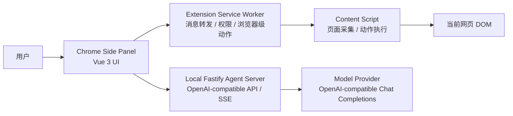
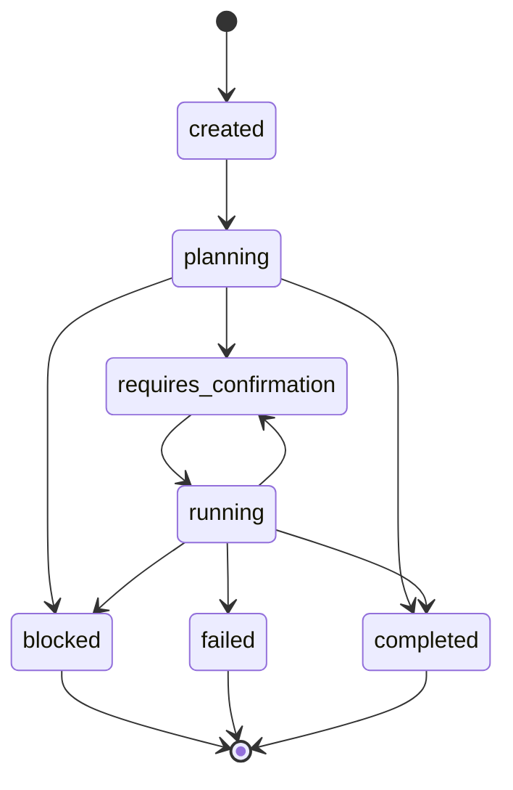

# Chrome AI Agent 插件 MVP 技术方案

## 1. 方案概述

本文档对应 `docs/product-requirements.md` 中定义的 MVP 产品范围，目标是为 Chrome AI Agent 插件提供可落地的工程设计。当前仓库采用 Vue 3、Vite、pnpm、TypeScript、Pinia 和 Chrome Manifest V3 构建浏览器插件，通过本地 Node/Fastify 代理接入 OpenAI 兼容 Chat Completions API，并以“计划先行、确认后执行”的方式完成受控网页操作。

核心设计原则：

- 插件前端只负责页面感知、用户确认和受控动作执行，不直接保存或调用模型供应商 Key。
- 本地代理负责模型调用、Agent 计划生成、SSE 事件转换、run 状态和上下文裁剪。
- 认证、模型路由、审计、数据库和成本控制是产品化后端的后续扩展范围。
- 模型输出不得直接变成浏览器脚本，所有动作必须映射到白名单工具协议。
- 页面上下文采集采用最小化策略，只上传完成任务所需的可见信息和结构化元素清单。
- 高风险动作默认阻断，中风险动作必须由用户确认。

## 2. 总体架构



运行链路：

1. 用户打开插件 Side Panel 并输入任务。
2. Side Panel 请求 Service Worker 获取当前标签页上下文。
3. Service Worker 向 Content Script 发送采集指令。
4. Content Script 提取可见文本、选区、表单字段和可交互元素清单。
5. Side Panel 将用户目标和页面上下文提交给本地代理。
6. 本地代理创建 run，并通过 SSE 返回状态、计划、流式回答和动作请求。
7. Side Panel 展示计划，等待用户确认中风险动作。
8. 用户确认后，Service Worker 将动作转发给 Content Script。
9. Content Script 执行白名单动作并返回结果。
10. 当前实现把 run 状态保存在本地代理内存中；产品化后端可在此处接入审计、历史和成本统计。

## 3. 前端技术设计

### 3.1 技术栈

- Vue 3：Side Panel 和后续 Options Page。
- TypeScript：统一插件消息、后端接口和动作协议类型。
- Vite：开发、构建和多入口打包。
- pnpm：包管理。
- Pinia：侧边栏应用状态管理。
- Vue Router：后续 Options Page 或多视图扩展预留。
- Chrome Extension Manifest V3：插件运行时标准。

### 3.2 当前目录结构

```text
chrome-extension/
  docs/
    product-requirements.md
    technical-design.md
  public/
    icons/
      icon-16.png
      icon-32.png
      icon-48.png
      icon-128.png
  src/
    background/
      action-executors.ts
      service-worker.ts
    content/
      index.ts
      collect-page-context.ts
      execute-action.ts
      element-registry.ts
      risk-detector.ts
      selection-menu.ts
    side-panel/
      main.ts
      App.vue
      components/
        ChatComposer.vue
        ChatMessageItem.vue
        ChatPanel.vue
        LoginPanel.vue
        PageContextBar.vue
      stores/
        auth.ts
        agent-run.ts
        agent-run-messages.ts
        page-context.ts
      styles/
        base.css
    shared/
      api-client.ts
      constants.ts
      extension-messages.ts
      id.ts
      markdown.ts
      types.ts
      url-action.ts
  server/
    agent-prompt.ts
    agent-routes.ts
    config.ts
    index.ts
    model-tools.ts
    run-store.ts
    sse.ts
  manifest.config.ts
  package.json
  pnpm-lock.yaml
  tsconfig.json
  vite.config.ts
```

说明：

- `background/` 只处理插件生命周期、消息转发、权限、标签页事件和浏览器级动作。
- `content/` 只运行在网页上下文中，负责 DOM 采集和白名单动作执行。
- `side-panel/` 是用户可见界面，不直接访问页面 DOM；聊天输入、消息渲染和 run 编排分离。
- `shared/` 保存跨模块类型、协议和 API 客户端，避免消息结构漂移。
- `server/` 是本地模型代理，入口保持很薄，路由、配置、状态、prompt 和 SSE 分模块维护。

### 3.3 Manifest V3 配置

首版建议权限：

```json
{
  "manifest_version": 3,
  "name": "Chrome AI Agent",
  "version": "0.1.0",
  "permissions": ["activeTab", "storage", "scripting", "sidePanel", "tabs"],
  "host_permissions": ["http://localhost:8787/*", "http://127.0.0.1:8787/*"],
  "background": {
    "service_worker": "src/background/service-worker.ts",
    "type": "module"
  },
  "side_panel": {
    "default_path": "src/side-panel/index.html"
  },
  "action": {
    "default_title": "Chrome AI Agent"
  },
  "content_scripts": [
    {
      "matches": ["<all_urls>"],
      "js": ["src/content/index.ts"],
      "run_at": "document_idle"
    }
  ]
}
```

实际构建时 Manifest 由 `manifest.config.ts` 生成，再由 Vite 插件输出到 `dist/manifest.json`。开发阶段可使用 `@crxjs/vite-plugin` 或同类 Manifest V3 打包方案。

权限策略：

- `activeTab` 用于用户主动触发后访问当前标签页。
- `sidePanel` 用于主交互入口。
- `storage` 用于保存登录态、用户设置和轻量缓存。
- `scripting` 用于必要时注入或检查 Content Script。
- `tabs` 用于监听活动标签页变化并刷新 Side Panel 中的页面上下文。
- `host_permissions` 当前只允许访问本地代理地址，不申请任意站点网络权限。

## 4. 插件消息协议

### 4.1 消息流向

插件内部使用 `chrome.runtime.sendMessage` 和 `chrome.tabs.sendMessage`。所有消息必须带 `type` 字段，payload 必须通过 TypeScript 类型或运行时 schema 校验。

主要流向：

- Side Panel -> Local Server：创建 run、订阅 SSE、停止 run。
- Side Panel -> Service Worker：请求页面上下文、确认动作后执行动作。
- Service Worker -> Content Script：采集页面上下文、执行白名单页面动作。
- Content Script -> Service Worker：返回采集结果、动作执行结果、页面错误。
- Content Script -> Service Worker：选中文本菜单触发翻译、解释或添加到对话。
- Service Worker -> Side Panel：通知活动标签页变化；选区 payload 通过 `chrome.storage.local` 交接。

### 4.2 消息类型定义

```ts
export type ExtensionMessage =
  | GetPageContextMessage
  | ExecuteActionMessage
  | SelectionActionInvokeMessage
  | ActiveTabChangedMessage;

export interface GetPageContextMessage {
  type: "page_context:get";
  payload: {
    includeSelection: boolean;
    includeInteractiveElements: boolean;
    tabId?: number;
  };
}

export interface ExecuteActionMessage {
  type: "agent_action:execute";
  payload: {
    runId: string;
    action: AgentAction;
  };
}

export interface SelectionActionInvokeMessage {
  type: "selection_action:invoke";
  payload: SelectionActionPayload;
}

export interface ActiveTabChangedMessage {
  type: "active_tab:changed";
  payload: {
    tabId: number;
    windowId: number;
    url?: string;
    title?: string;
    status?: "loading" | "complete" | "unloaded";
  };
}
```

`highlight_element` 不再有独立 runtime message；它作为 `agent_action:execute` 的白名单工具在 Content Script 内执行。

### 4.3 错误协议

```ts
export interface ExtensionError {
  code:
    | "NOT_AUTHENTICATED"
    | "TAB_NOT_ACCESSIBLE"
    | "CONTENT_SCRIPT_UNAVAILABLE"
    | "PAGE_CONTEXT_BLOCKED"
    | "ACTION_REJECTED"
    | "ACTION_TARGET_MISSING"
    | "ACTION_RISK_BLOCKED"
    | "NETWORK_ERROR"
    | "UNKNOWN_ERROR";
  message: string;
  retryable: boolean;
  details?: Record<string, unknown>;
}
```

## 5. 页面上下文采集

### 5.1 采集对象

```ts
export interface PageContext {
  url: string;
  origin: string;
  title: string;
  selectedText: string;
  visibleTextSummary: string;
  headings: PageHeading[];
  tables: PageTableSummary[];
  interactiveElements: InteractiveElement[];
  collectedAt: string;
}

export interface InteractiveElement {
  id: string;
  tagName: string;
  role: string;
  label: string;
  valuePreview?: string;
  inputType?: string;
  placeholder?: string;
  rect: {
    x: number;
    y: number;
    width: number;
    height: number;
  };
  riskLevel: ActionRiskLevel;
  disabled: boolean;
}
```

### 5.2 元素 ID 机制

Content Script 为可交互元素生成短期 `elementId`，并在内存中的 `ElementRegistry` 保存映射。

要求：

- `elementId` 不直接暴露 CSS Selector 或 XPath。
- 映射仅在当前页面生命周期内有效。
- 页面 URL、DOM 结构或元素位置明显变化后，需要重新采集上下文。
- 执行动作前必须重新验证元素仍然存在且可见。

### 5.3 可见文本提取

采集规则：

- 只读取可见文本节点。
- 跳过 `script`、`style`、`noscript`、`template`。
- 跳过 `display: none`、`visibility: hidden`、尺寸为 0 的元素。
- 长文本需要截断或摘要，避免超过后端限制。
- 输入框内容只采集普通文本输入的短预览，敏感字段不采集。

### 5.4 敏感字段过滤

过滤规则：

- `type="password"` 永不读取。
- `autocomplete` 包含 `cc-`、`password`、`one-time-code` 的字段永不读取。
- `name`、`id`、`aria-label`、`placeholder` 命中 `password`、`token`、`secret`、`card`、`cvv`、`otp`、`idcard` 等关键词时永不读取。
- 隐藏字段和不可见字段永不读取。
- Cookie、localStorage、sessionStorage 不在任何采集路径中访问。

## 6. Agent 动作协议

### 6.1 动作类型

```ts
export type AgentToolName =
  | "read_page"
  | "summarize_selection"
  | "extract_table"
  | "highlight_element"
  | "click_element"
  | "fill_input"
  | "scroll_page"
  | "open_url"
  | "copy_result";

export type ActionRiskLevel = "low" | "medium" | "high";

export interface AgentAction {
  id: string;
  toolName: AgentToolName;
  riskLevel: ActionRiskLevel;
  requiresConfirmation: boolean;
  target?: {
    elementId?: string;
    description: string;
  };
  input?: {
    text?: string;
    value?: string;
    url?: string;
  };
  reason: string;
}
```

### 6.2 动作执行状态

```ts
export type AgentActionStatus =
  | "pending_confirmation"
  | "confirmed"
  | "skipped"
  | "running"
  | "succeeded"
  | "blocked"
  | "failed";

export interface AgentActionResult {
  actionId: string;
  status: AgentActionStatus;
  message: string;
  output?: unknown;
  error?: ExtensionError;
}
```

### 6.3 风险控制

执行前校验顺序：

1. 工具名必须在白名单中。
2. `riskLevel` 必须与前端本地风险检测结果一致或更保守。
3. 中风险动作必须存在用户确认记录。
4. 高风险动作直接阻断。
5. 目标元素必须存在、可见、未禁用。
6. 目标元素不得是密码、验证码、支付、删除、提交等敏感控件。
7. 页面 URL 与动作计划生成时的 URL 必须一致，或要求用户重新确认。
8. `open_url` 属于浏览器级工具，由 Background 执行，只允许 `http` / `https`，并且需要用户确认。

## 7. 本地代理技术设计

### 7.1 当前后端栈

当前仓库使用 Node.js + TypeScript + Fastify 实现本地模型代理，便于与插件前端共享类型。当前组合：

- Fastify：HTTP API、健康检查和 SSE。
- OpenAI SDK：调用 OpenAI 兼容 Chat Completions API。
- 内存 Map：保存当前进程内的 run 状态和活动流。
- TypeScript shared types：复用 `src/shared/types.ts` 中的 Agent、动作和事件类型。

认证、持久化、审计、额度和多供应商路由不在当前本地演示版中实现；后续产品化时可以保持协议不变并替换或扩展后端实现。

### 7.2 当前服务模块

| 模块 | 职责 |
| --- | --- |
| `server/index.ts` | Fastify 初始化、CORS 注册、路由注册和监听启动 |
| `server/config.ts` | 读取端口、模型、超时、重试和 `OPENAI_BASE_URL` |
| `server/agent-routes.ts` | 注册健康检查、创建 run、SSE stream、停止 run |
| `server/run-store.ts` | 内存 run 存储、活动流管理、页面上下文裁剪 |
| `server/agent-prompt.ts` | 构造默认计划和模型 prompt |
| `server/model-tools.ts` | OpenAI tool 定义、tool call 累积和动作生成 |
| `server/sse.ts` | SSE 事件写入、结束事件和错误事件转换 |

### 7.3 Agent 状态机



状态说明：

- `created`：任务已创建。
- `planning`：模型正在理解任务并生成计划。
- `requires_confirmation`：等待用户确认动作。
- `running`：动作已确认，等待插件执行并回传结果。
- `stopped`：用户停止当前流式回答或本地代理中止活动流。
- `blocked`：安全策略阻断。
- `failed`：系统错误或模型错误。
- `completed`：任务完成。

## 8. 本地代理接口设计

### 8.1 健康检查

```http
GET /health
GET /health/openai
```

`/health` 返回当前模型和 OpenAI timeout；`/health/openai` 会实际调用模型供应商的 models list，用于验证 Key、Base URL 和网络连通性。

### 8.2 Agent 任务

```http
POST /api/agent/runs
POST /api/agent/runs/:runId/stream
POST /api/agent/runs/:runId/stop
```

创建任务请求：

```ts
export interface CreateAgentRunRequest {
  goal: string;
  pageContext: PageContext;
}
```

任务响应：

```ts
export interface AgentRun {
  id: string;
  status: AgentRunStatus;
  goal: string;
  pageUrl: string;
  pageTitle: string;
  plan?: AgentPlan;
  createdAt: string;
  updatedAt: string;
}
```

动作确认和动作执行当前发生在插件内：Side Panel 确认后通过 Service Worker 转发 `agent_action:execute`，执行结果再写回聊天流。当前本地代理不提供独立的 action confirm/result HTTP 接口。

### 8.3 SSE 事件

```ts
export type AgentRunEvent =
  | { type: "status"; runId: string; status: AgentRunStatus }
  | { type: "message"; runId: string; text: string }
  | { type: "message_delta"; runId: string; messageId: string; text: string; done?: boolean; channel?: "thinking" | "answer" }
  | { type: "plan"; runId: string; plan: AgentPlan }
  | { type: "action_request"; runId: string; action: AgentAction }
  | { type: "action_result"; runId: string; result: AgentActionResult }
  | { type: "error"; runId: string; error: ExtensionError };
```

SSE 要求：

- 每个事件带 `runId`。
- 流式文本使用 `message_delta`，前端按 `messageId` 追加内容。
- 服务端需要在任务完成、失败或阻断后关闭流。

## 9. 模型工具设计

### 9.1 当前工具定义

当前本地代理只把 `open_url` 暴露给模型工具调用。模型请求工具时，`server/model-tools.ts` 会累积流式 tool call、解析 JSON 参数、校验 URL，并生成插件内部 `AgentAction`。未知工具或非法参数会被转换为阻断说明。

### 9.2 后续 Provider 抽象

产品化后端可以在当前协议上增加 Provider 抽象：

```ts
export interface ModelProvider {
  id: string;
  displayName: string;
  capabilities: ModelCapability[];
  createStream(input: AgentRunInput): AsyncIterable<AgentRunEvent>;
}
```

后续路由策略：

- 中文网页和中文任务优先考虑中文效果稳定的模型。
- 长页面优先选择长上下文能力更好的模型。
- 结构化输出或动作计划优先选择工具调用能力稳定的模型。
- 主模型失败时按供应商优先级降级。
- 用户额度不足时返回明确错误，不静默切换到不可用模型。

### 9.3 输出校验

模型输出必须经过 schema 校验：

- `toolName` 必须在白名单中。
- `riskLevel` 只能是 `low`、`medium`、`high`。
- `target.elementId` 必须来自本次页面上下文。
- `fill_input` 的 `input.value` 不得包含明显敏感字段内容。
- 高风险动作必须被标记为 `blocked` 或 `requiresConfirmation`，MVP 后端统一阻断。

## 10. 数据库设计

### 10.1 核心表

```text
users
  id
  email
  quota_remaining
  created_at
  updated_at

sessions
  id
  user_id
  token_hash
  expires_at
  created_at

agent_runs
  id
  user_id
  goal
  page_url
  page_origin
  page_title
  status
  model_route
  created_at
  updated_at

agent_actions
  id
  run_id
  tool_name
  risk_level
  status
  target_description
  input_preview
  reason
  created_at
  updated_at

action_confirmations
  id
  action_id
  user_id
  decision
  reason
  created_at

model_call_logs
  id
  run_id
  provider
  model
  prompt_tokens
  completion_tokens
  cost
  latency_ms
  status
  created_at

audit_logs
  id
  user_id
  run_id
  action
  metadata
  created_at
```

### 10.2 数据保留

- 任务历史默认保留 30 天。
- 用户可手动删除任务历史。
- 删除任务历史时同步删除页面摘要、动作输入预览和模型输出正文。
- 成本统计和安全审计可保留脱敏后的聚合记录。

## 11. 安全与隐私

### 11.1 前端安全

- Content Script 不执行模型生成的任意 JavaScript。
- Side Panel 不渲染未经处理的 HTML。
- 所有模型返回文本按纯文本或安全 Markdown 渲染。
- 动作执行前进行本地二次风险判断。
- 用户退出登录时清除本地 Token、任务缓存和页面上下文缓存。

### 11.2 后端安全

- 模型供应商 API Key 只保存在服务端密钥管理系统或环境变量中。
- 所有接口必须校验用户身份。
- 对创建任务、模型调用和动作确认接口做限流。
- Agent 计划写入数据库前先做 schema 校验和风险校验。
- 审计日志避免保存敏感正文。

### 11.3 Prompt Injection 防护

网页内容可能包含诱导模型忽略规则的恶意文本。后端系统提示词必须明确：

- 网页内容是不可信输入。
- 网页内容不能覆盖系统安全策略。
- 模型不得请求插件读取 Cookie、localStorage、密码或隐藏字段。
- 模型不得生成白名单外工具。
- 模型必须把高风险动作标记为阻断。

## 12. 构建与开发流程

### 12.1 pnpm 脚本

建议脚本：

```json
{
  "scripts": {
    "dev": "vite --host localhost --mode development",
    "server:dev": "tsx watch server/index.ts",
    "dev:all": "concurrently -n extension,server -c blue,green \"pnpm dev\" \"pnpm server:dev\"",
    "build": "vue-tsc --noEmit && vite build",
    "preview": "vite preview",
    "typecheck": "vue-tsc --noEmit",
    "server:typecheck": "tsc --noEmit -p server/tsconfig.json",
    "test": "vitest run",
    "test:watch": "vitest"
  }
}
```

### 12.2 本地开发

1. `pnpm install`
2. 复制 `.env.example` 为 `.env`，并设置 `OPENAI_API_KEY`
3. `pnpm dev:all`
4. 打开 `chrome://extensions`
5. 启用开发者模式
6. 加载 `dist` 或开发插件输出目录
7. 打开普通网页并测试 Side Panel

### 12.3 环境变量

前端只允许保存后端地址等非敏感配置：

```text
VITE_AGENT_API_BASE_URL=http://127.0.0.1:8787
```

模型供应商 Key 只存在后端：

```text
AI_AGENT_PORT=8787
OPENAI_MODEL=MiniMax-M2.7
OPENAI_TIMEOUT_MS=120000
OPENAI_MAX_RETRIES=1
OPENAI_BASE_URL=https://api.minimaxi.com/v1
OPENAI_API_KEY=
```

`OPENAI_BASE_URL` 可以替换为 OpenAI 官方或其他 OpenAI 兼容供应商地址，`OPENAI_MODEL` 需要同步改成该供应商可用的模型名。

## 13. 测试方案

### 13.1 单元测试

覆盖范围：

- URL 动作归一化和危险协议阻断。
- Agent run 事件到聊天消息的纯函数转换。
- 页面可见文本提取、敏感字段过滤和元素风险识别。
- 动作协议校验和模型工具参数校验。
- Agent 状态机流转。

### 13.2 集成测试

覆盖范围：

- Side Panel 发起任务到本地代理创建 run。
- SSE 事件驱动计划展示。
- 用户确认后 Content Script 执行动作。
- 执行结果写回当前聊天流。
- 未登录演示态、本地代理不可用和模型调用失败处理。

### 13.3 E2E 测试

推荐使用 Playwright 加载插件构建产物，准备本地测试网页：

- 普通文章页：验证总结和问答。
- 表单页：验证字段识别、确认和填写。
- 支付模拟页：验证高风险动作阻断。
- 登录模拟页：验证密码字段不采集。
- 动态 DOM 页：验证元素失效后的停止和提示。

### 13.4 安全测试

覆盖范围：

- 网页中嵌入 prompt injection 文本，验证模型不突破策略。
- 模型返回未知工具名，验证后端阻断。
- 模型返回任意脚本，验证前后端均拒绝。
- 用户未确认中风险动作，验证插件不执行。
- 页面 URL 变化后，验证动作需要重新确认。

## 14. 发布与监控

### 14.1 插件发布检查

- Manifest V3 权限说明完整。
- 无远程托管代码。
- 无未使用权限。
- 隐私政策说明页面内容采集范围、用途和删除方式。
- 插件截图覆盖登录、任务输入、计划确认和结果展示。

### 14.2 后端监控

关键指标：

- Agent 任务创建量。
- 任务完成率、失败率、阻断率。
- 平均计划生成耗时。
- SSE 断连率。
- 模型调用成本。
- 各 Provider 成功率和降级次数。
- 高风险动作拦截次数。

### 14.3 日志要求

- 请求日志不记录完整页面正文。
- 错误日志保留错误码、runId、provider、耗时和脱敏上下文。
- 安全日志记录阻断原因和策略版本。
- 用户删除历史后，不再通过普通后台接口展示该任务正文。

## 15. 实施里程碑

### 15.1 阶段一：插件骨架

- 初始化 Vue 3 + Vite + pnpm + TypeScript 项目。
- 配置 Manifest V3、Side Panel、Service Worker 和 Content Script。
- 完成插件内部消息协议。
- 完成基础 UI 状态和登录占位流程。

### 15.2 阶段二：页面上下文与动作执行

- 实现页面上下文采集。
- 实现敏感字段过滤和元素 ID 映射。
- 实现 `highlight_element`、`fill_input`、`click_element` 等白名单动作。
- 实现前端风险判断和用户确认卡片。

### 15.3 阶段三：后端代理与 Agent

- 实现认证、模型列表、Agent run 和 SSE 接口。
- 接入至少一个主模型 Provider 和一个降级 Provider。
- 实现模型输出 schema 校验和 Tool Policy。
- 实现任务历史、动作确认和基础审计。

### 15.4 阶段四：验收与加固

- 完成文章页、表单页、支付模拟页、登录模拟页 E2E 测试。
- 完成 prompt injection 和未知工具安全测试。
- 完成 Chrome 插件权限检查。
- 准备 Chrome Web Store 发布材料。

## 16. MVP 验收清单

- 插件可在 Chrome 中加载并打开 Side Panel。
- 用户登录后可以发起当前网页 Agent 任务。
- 插件只采集允许范围内的页面上下文。
- 后端可以返回 Agent 计划和动作请求。
- 中风险动作必须用户确认后执行。
- 高风险动作默认阻断。
- Content Script 不执行任意脚本。
- 动作结果可回传并更新任务状态。
- 用户可以停止任务和删除任务历史。
- 模型供应商 Key 不出现在前端构建产物中。
